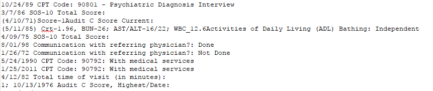
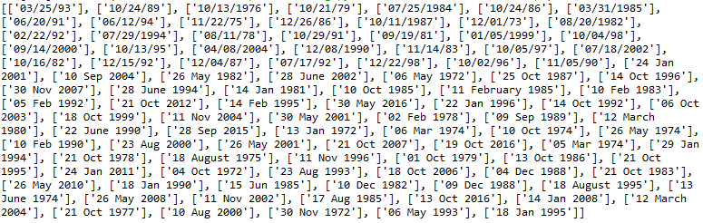

The objective is to extract the date from medical notes.

The dates must have a format X/X/XXX or XX/XX/XXXX.

#### Extract of the initial document


#### Output: 


### The code
```python
import csv
import re

with open ("dates.txt") as out:
    reader = csv.reader(out)
    text = out.readlines()

formatted_dates = []
for j in text:
    regex2 =  re.findall(r'\d{2}[/-]\d{2}[/-]\d{2,4}',str(j)) or re.findall(r'(?:\d{2} )(?:Jan|Feb|Mar|Apr|May|Jun|Jul|Aug|Sep|Oct|Nov|Dec)[a-z]* (?:\d{2}, )?\d{4}',str(j))
    if regex2 == []:
        pass
    else:
        formatted_dates.append(regex2)    
print(formatted_dates)
```